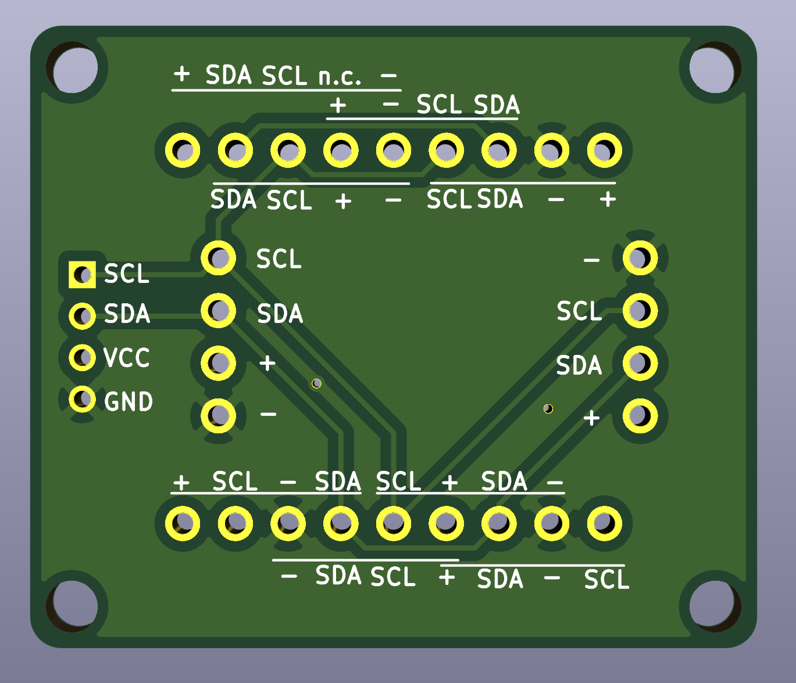
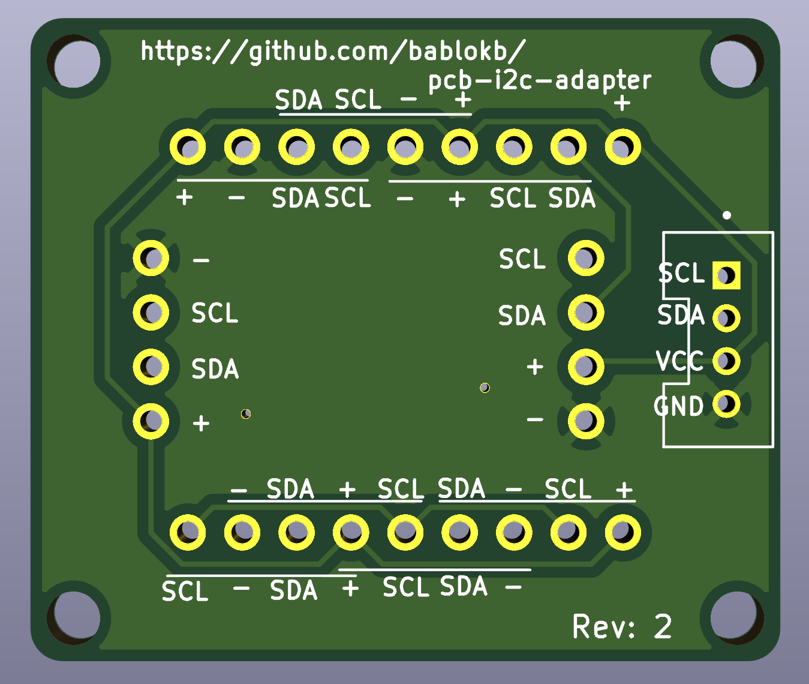

pcb-i2c-adapter
===============

This is a small PCB mapping various I2C pin combinations to a Grove connector.

Useful to connect all kinds of I2C-breakouts using Grove. Since every
breakout uses it's own pin-order, the PCB supports eight different
variations (additionally the Pi-variant: with 
pins 1 (3V3), 3 (SDA), 5 (SCL), 7 (nc), 9 (GND)).

KiCAD design-files are in the subdirectory `pcb-i2c-adapter`.

License
-------

[![CC BY-SA 4.0][cc-by-sa-shield]][cc-by-sa]

This work is licensed under a
[Creative Commons Attribution-ShareAlike 4.0 International
License][cc-by-sa].

[![CC BY-SA 4.0][cc-by-sa-image]][cc-by-sa]

[cc-by-sa]: http://creativecommons.org/licenses/by-sa/4.0/
[cc-by-sa-image]: https://licensebuttons.net/l/by-sa/4.0/88x31.png
[cc-by-sa-shield]:
https://img.shields.io/badge/License-CC%20BY--SA%204.0-lightgrey.svg
